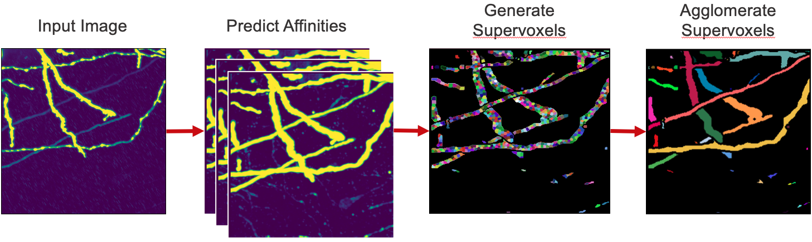

# Neuron Segmentation

[](LICENSE)

[](https://github.com/semantic-release/semantic-release)


A Python package for performing neuron segmentation in ExaSPIM image datasets, designed for large-scale, high-resolution volumetric data. The pipeline combines deep learning–based affinity prediction with graph-based algorithms to produce accurate neuron reconstructions.


## Method

The segmentation pipeline consists of three main steps:

<blockquote>
  <p>1. <strong>Affinity Prediction</strong>: 3D CNN predicts voxel affinities indicating which neighboring voxels belong to the same neuron.</p>
  <p>2. <strong>Watershed Algorithm</strong>: Seeded watershed uses the affinity maps to produce an initial oversegmentation into supervoxels.</p>
  <p>3. <strong>Supervoxel Agglomeration</strong>: Supervoxels are iteratively merged using a graph-based algorithm to form full neuron segments.</p>
</blockquote>

In addition, the repository provides tools for skeletonization and exporting the results as a ZIP archive of SWC files.
<br>
<br>

<p>
  
  <br>
  <b> Figure: </b>Visualization of segmentation pipeline.
</p>

## Installation
To use the software, in the root directory, run
```bash
pip install -e .
```
