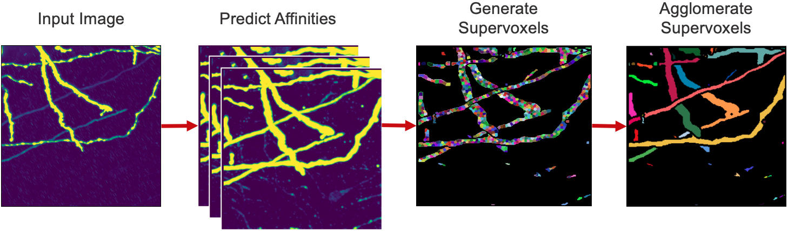

# Neuron Segmentation

[](LICENSE)

[](https://github.com/semantic-release/semantic-release)


A Python package for performing neuron segmentation in ExaSPIM image datasets, designed for large-scale, high-resolution volumetric data. The pipeline combines deep learning–based affinity prediction with graph-based algorithms to produce accurate neuron reconstructions.


## Method

The segmentation pipeline consists of three main steps:

<blockquote>
  <p>1. <strong>Affinity Prediction</strong>: 3D CNN predicts affinities between neighboring voxels.</p>
  <p>2. <strong>Watershed Algorithm</strong>: Seeded watershed transforms affinities into an initial supervoxel oversegmentation.</p>
  <p>3. <strong>Supervoxel Agglomeration</strong>: Supervoxels are iteratively merged using a graph-based algorithm.</p>
</blockquote>

In addition, this repository provides tools for skeletonization and saving the result as a ZIP archive of SWC files.
<br>
<br>

<p>
  
  <br>
  <b> Figure: </b>Visualization of segmentation pipeline.
</p>

## Installation
To use the software, in the root directory, run
```bash
pip install -e .
```

## Predict

Here’s an example of running the segmentation pipeline.

```python
from aind_exaspim_neuron_segmentation import inference
from aind_exaspim_neuron_segmentation.utils import img_util


# Parameters
affinity_mode = True
patch_shape = (96, 96, 96)

# Load model
model_path = "path-to-model-weights"
model = inference.load_model(model_path, affinity_mode=affinity_mode)

# Read image
img_path = "path-to-image"
img = img_util.read(img_path)

# Predict affinites
affinites = inference.predict(
    img,
    model,
    affinity_mode=affinity_mode,
    patch_shape=patch_shape,
)

# Generate segmentation via watershed and supervoxel agglomeration
segmentation = inference.affinities_to_segmentation(affinites)
```

## Contact Information
For any inquiries, feedback, or contributions, please do not hesitate to contact us. You can reach us via email at anna.grim@alleninstitute.org or connect on [LinkedIn](https://www.linkedin.com/in/anna-m-grim/).

## License
aind-exaspim-neuron-segmentation is licensed under the MIT License.
